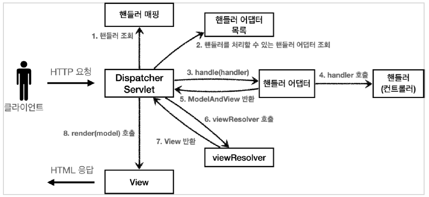
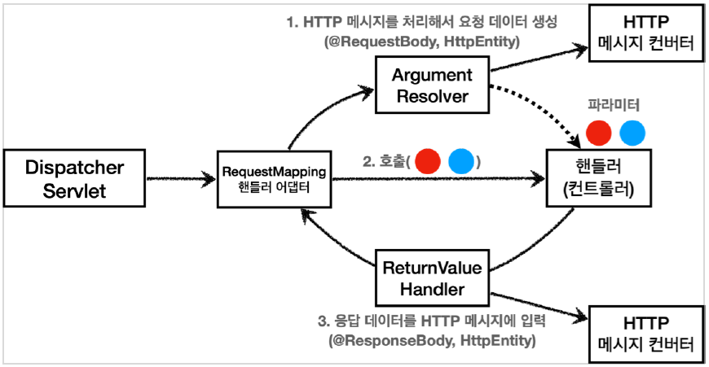

[인프런] 스프링 MVC 1편 - 백엔드 웹 개발 핵심 기술  
[목차 바로가기](./INDEX.md)

## 1. 웹 애플리케이션의 이해

- 서블릿은 HTTP 스펙을 편리하게 사용할 수 있게 도와주는 도구임
  (개발자는 HTTP 요청 메시지를 파싱해서 읽기 등의 작업 필요 X)
  핵심은 WAS에 서블릿을 등록해서 사용하면 됨
- 톰캣처럼 서블릿을 지원하는 **WAS를 서블릿 컨테이너**라고 함
  즉, 서블릿 컨테이너는 request 객체를 서블릿에 넘겨주는 역할 수행
- 서블릿 컨테이너는 서블릿 객체를 생성, 초기화, 호출, 종료하는 생명주기 관리
- 서블릿 객체는 싱글톤으로 관리
- WAS 서버들(톰캣, 제티 등)은 서블릿 표준 스펙을 구현한다.

### 1.1 동시요청 - 멀티 쓰레드

- 애플리케이션 코드를 하나하나 순차적으로 실행하는 것은 쓰레드.
  한번에 하나의 코드 라인만 수행
- 자바 메인 메서드를 처음 실행하면 main이라는 이름의 쓰레드가 실행
- 동시 처리가 필요하면 쓰레드를 추가로 생성
- **쓰레드 풀** : 요청마다 쓰레드 생성의 단점 보완
    - 필요한 쓰레드를 쓰레드 풀에 보관하고 관리. 사용을 종료하면 쓰레드 풀에 해당 쓰레드를 반납
    - 최대 쓰레드가 모두 사용중이어서 쓰레드 풀에 쓰레드가 없으면? 기다리는 요청은 거절하거나 특정 숫자만큼만 대기하도록 설정할 수 있다
    - 쓰레드가 미리 생성되어 있으므로, 쓰레드를 생성하고 종료하는 비용(CPU)이 절약되고, 응답 시간이 빠르다

---

## 2. 서블릿

- 서블릿 예시 코드
  서블릿 등록은 web.xml 또는 스프링 어노테이션 `@ServletComponentScan` 서블릿 자동 등록 방식 이용. `@WebServlet` 을 붙여서 등록 대상임을 명시

    ```java
    @WebServlet(name = "helloServlet", urlPatterns = "/hello")
    public class HelloServlet extends HttpServlet {
        @Override
        public void service(ServletRequest request, ServletResponse response) throws ServletException, IOException {
    		}
    }
    ```


### 2.4 HttpServletRequest - 기본 사용법

- `HttpServletRequest` 객체로부터 Locale, RemoteAddr, ContentType 등을 확인할 수 있다.

### 2.5 HTTP 요청 데이터 - 개요

- 주로 3가지 방법을 사용
    - **GET - 쿼리 파라미터**  
      메시지 바디 없이, URL의 쿼리 파라미터에 데이터를 포함해서 전달  
      예) 검색, 필터, 페이징등에서 많이 사용하는 방식  
    - **POST - HTML Form**  
      content-type: application/x-www-form-urlencoded  
      메시지 바디에 쿼리 파리미터 형식으로 전달 username=hello&age=20  
      예) 회원 가입, 상품 주문, HTML Form 사용  
    - **HTTP message body에 데이터를 직접 담아서 요청**  
      HTTP API에서 주로 사용, JSON, XML, TEXT  

### 2.6 HTTP 요청 데이터 - GET 쿼리 파라미터

- 이름이 같은 복수 파라미터 조회  
  예) *http://localhost:8080/request-param?username=hello&username=kim&age=20*  
  `String[] usernames = request.getParameterValues("username");`

### 2.7 HTTP 요청 데이터 - POST HTML Form

- content-type: application/x-www-form-urlencoded
- 메시지 바디에 쿼리 스트링으로 전달 됨
- 클라이언트(웹 브라우저) 입장에서는 두 방식에 차이가 있지만, 서버 입장에서는 둘의 형식이 동일하므로, `request.getParameter()` 로 편리하게 구분없이 조회할 수 있다.
- HTML Form 데이터 보낼 때는 HTML 스펙상 POST만 가능하고 PUT, PATCH 안됨
  스프링에서는 내부적으로 히든 필드 사용하여 처리해 주는 것임

### 2.8 HTTP 요청 데이터 - API메시지 바디 - JSON

- content-type: application/json
- 메시지 바디 문자열을 java 객체로 변환하려면 라이브러리 필요 : SpringBoot 는 jackson 라이브러리 기본 내장

### 2.9 HttpServletResponse - 기본 사용법

- HTTP응답 코드, 헤더, 바디, 쿠키
- 편의 메서드를 적절히 사용할 수 있음. 아래의 두 코드는 같음

    ```java
    //response.setHeader("Content-Type", "text/plain;charset=utf-8");
    response.setContentType("text/plain");
    response.setCharacterEncoding("utf-8");
    ```


### 2.10 HTTP 응답 데이터 - 단순 텍스트, HTML

- HTTP 응답으로 HTML을 반환할 때는 content-type을 text/html 로 지정
- JSON 응답으로 데이터를 반환할 때는 content-type을 application/json으로 지정

---

## 3. 서블릿, JSP, MVC 패턴

- 서블릿에서 JSP 뷰를 반환하는 방식은 내부적으로 `RequestDispatcher`가 이용된다.
  forward 하여 서버 내부에서 다시 호출이 발생 (JSP 서블릿 호출)

    ```java
    String viewPath = "/WEB-INF/views/new-form.jsp";
    RequestDispatcher dispatcher = request.getRequestDispatcher(viewPath);
    dispatcher.forward(request, response);
    ```


## 4. MVC 프레임워크 만들기

- `프론트 컨트롤러` 서블릿 하나로 클라이언트의 요청을 받고 요청에 맞는 컨트롤러를 찾아서 호출
- 스프링 웹 MVC의 DispatcherServlet이 FrontController 패턴으로 구현되어 있음
- 프론트 컨트롤러는 핸들러 매핑 정보를 뒤져서 url 패턴에 맞는 컨트롤러를 호출함
- 여기서 어댑터는 컨트롤러의 반환 스펙과 프론트 컨트롤러의 요구 스펙을 중간에서 맞춰주는 어댑터 역할을 함

---

## 5. 스프링MVC - 구조 이해



### 5.1 스프링 MVC 전체 구조 ⭐⭐⭐

1. **핸들러 조회**: 핸들러 매핑을 통해 요청 URL에 매핑된 핸들러(컨트롤러)를 조회한다.
2. **핸들러 어댑터 조회**: 핸들러를 실행할 수 있는 핸들러 어댑터를 조회한다.
3. **핸들러 어댑터 실행**: 핸들러 어댑터를 실행한다.
4. **핸들러 실행**: 핸들러 어댑터가 실제 핸들러를 실행한다.
5. **ModelAndView 반환**: 핸들러 어댑터는 핸들러가 반환하는 정보를 ModelAndView로 변환해서
   반환한다.
6. **viewResolver 호출**: 뷰 리졸버를 찾고 실행한다.
7. **View 반환**: 뷰 리졸버는 뷰의 논리 이름을 물리 이름으로 바꾸고, 렌더링 역할을 담당하는 뷰 객체를 반환한다.
8. **뷰 렌더링**: 뷰를 통해서 뷰를 렌더링 한다.

### 5.4 스프링MVC - 시작하기

- 핸들러(컨트롤러), 어댑터를 등록하는 방식은 여러가지가 있다. 그러나 애노테이션 방식을 가장 일반적으로 사용. 우선순위도 높다.
    - **HandlerMapping**  
      0 = RequestMappingHandlerMapping : 애노테이션 기반의 컨트롤러인 @RequestMapping에서 사용  
      1 = BeanNameUrlHandlerMapping : 스프링 빈의 이름으로 핸들러를 찾는다.
    - **HandlerAdapter**  
      0 = RequestMappingHandlerAdapter : 애노테이션 기반의 컨트롤러인 @RequestMapping에서 사용  
      1 = HttpRequestHandlerAdapter : HttpRequestHandler 처리  
      2 = SimpleControllerHandlerAdapter : Controller 인터페이스(애노테이션X, 과거에 사용)  
      처리
- DispatcherServlet에서 핸들러매핑, 핸들러 어댑터 필요할텐데?
  ⇒ 애노테이션 기반의 방식에서 `RequestMappingHandlerMapping`, `RequestMappingHandlerAdapter` 기본 지원

### 5.6 스프링MVC - 실용적인 방식

- 리턴타입이 ModelAndView가 아닌 String으로 ViewName 직접 반환
- @RequestParam 사용 : HttpServletRequest에서 getParameter하지 않아도 됨

---

## 6. 스프링 MVC - 기본 기능

### 6.2 로깅 간단히 알아보기

- 로그 선언

    ```java
    private Logger log = LoggerFactory.getLogger(getClass());
    private static final Logger log = LoggerFactory.getLogger(Xxx.class);
    @Slf4j // 롬복 사용 가능
    ```

- LEVEL: TRACE > DEBUG > INFO > WARN > ERROR
  application.yml에서 패키지별 로그레벨 설정 (root는 너무 많은 로그 출력됨)
- 연결 연산자(+) 사용하지 말자

### 6.3 요청 매핑

- `@PathVariable` 경로 변수 사용
- Content-Type 헤더 기반 추가 매핑 Media Type
  `@PostMapping(value = "/mapping-consume", consumes = "application/json")`
- Accept 헤더 기반 Media Type
  `@PostMapping(value = "/mapping-produce", produces = "text/html")`

### 6.5 HTTP요청 - 기본, 헤더 조회

- `HttpMethod` , `Locale` , `@RequestHeader("host") String host` , `@CookieValue(value = "myCookie", required = false) String cookie`
- **@Conroller 의 사용 가능한 파라미터 목록은 다음 공식 메뉴얼에서 확인할 수 있다. (중요)**
  [https://docs.spring.io/spring-framework/docs/current/reference/html/web.html#mvc-annarguments](https://docs.spring.io/spring-framework/reference/6.1-SNAPSHOT/web/webflux/controller/ann-methods/arguments.html)

### 6.7 HTTP 요청 파라미터 - @RequestParam

- `@RequestParam` : 파라미터 이름으로 바인딩
- `@ResponseBody` : View 조회를 무시하고, HTTP message body에 직접 해당 내용 입력
- String , int , Integer 등의 단순 타입이면 @RequestParam 도 생략 가능
- `defaultValue` : 값이 null이거나 빈문자일 때 기본값 적용
- 파라미터를 Map으로 조회

### 6.8 HTTP 요청 파라미터 - @ModelAttribute

- `@ModelAttribute` : 요청 파라미터를 받아서 필요한 객체를 만들고 그 객체에 값을 넣어주는 기능 제공
- `@ModelAttribute` 도 생략할 수 있다.

### 6.9 HTTP 요청 메시지 - 단순 텍스트

- **만약 Request가 Body를 통해 넘어온다면? @RequestParam, @ModelAttribute로 받을 수 없음(중요)**
- HttpMessageConverter 사용하자. 즉, `HttpEntity` 를 사용해 메시지 바디 정보를 직접 조회하거나 메시지 바디 정보를 직접 반환
- `@RequestBody` : HTTP 메시지 바디 정보를 편리하게 조회
- `@ResponseBody` : 응답 결과를 HTTP 메시지 바디에 직접 담아서 전달

```java
@ResponseBody
@PostMapping("/request-body-string-v4")
public String requestBodyStringV4(@RequestBody String messageBody) {
    log.info("messageBody={}", messageBody);
    return "ok";
}
```


    📌 요청 파라미터 vs HTTP 메시지 바디

    - 요청 파라미터를 조회하는 기능: @RequestParam , @ModelAttribut
      여기서 요청 파라미터는 GET방식의 쿼리 스트링 또는 Form방식으로 전송하는 것
    - HTTP 메시지 바디를 직접 조회하는 기능: @RequestBody


### 6.10 HTTP 요청 메시지 - JSON

- 단순 텍스트와 마찬가지로 `@RequestBody`, `@ResponseBody` 를 사용한다.
  애노테이션 생략 불가
- HTTP 요청시에 content-type이 application/json 이면 HttpMessageConverter가 실행 된다.
- `@ResponseBody` 를 사용하면 viewResolver 대신에 HttpMessageConverter 가 동작  
  기본 문자처리: StringHttpMessageConverter  
  기본 객체처리: MappingJackson2HttpMessageConverter  

### 6.11 응답 - 정적 리소스, 뷰 템플릿

- 일반적으로 뷰 템플릿은 HTML을 동적으로 생성하는 용도로 사용하지만, 다른 것들도 가능하다. 뷰 템플릿이 만들 수 있는 것이라면 뭐든지 가능
- 뷰 템플릿 경로 : src/main/resources/templates

### 6.12 HTTP 응답 - HTTP API, 메시지 바디에 직접 입력

- **HTTP StatusCode를 동적으로 반환하려면 리턴 타입을** `ResponseEntity` **사용.** 그렇지 않으면 메소드에 `@ResponseBody` 적용 또는 클래스 레벨에 `@RestController`

### 6.13 HTTP 메시지 컨버터

- HTTP 메시지 컨버터는 HTTP 요청, HTTP 응답 둘 다 사용된다.
- HTTP 메시지 컨버터가 요청을 읽고 응답 데이터를 생성할 수 있는 지 판단하기 위해 여러 조건을 검토한다.
    - 대상 클래스 타입을 지원하는가?
    - **요청** ⇒ HTTP 요청의 Content-Type 미디어 타입을 지원하는가. (text/plain, application/json)
    - **응답** ⇒ HTTP 요청의 Accept 미디어 타입을 지원하는가.(더 정확히는 @RequestMapping 의 produces )
- 조건을 만족하면 해당 컨버터의 read(), write() 호출

### 6.14 요청 매핑 핸들러 어댑터 구조



- 컨트롤러 호출에 필요한 매개변수를 만들어주는 역할을 **ArgumentResolver**가 함 (중요)
- ArgumentResolver는 @RequestBody, HttpEntity를 처리해야 되는 경우 HTTP메시지 컨버터를 사용한다.
- ArgumentResolver, HTTP메시지 컨버터, ReturnValueHandler는 각각 인터페이스이며 구현된 클래스가 매우 많음. 적절히 목적에 맞게 사용되고 확장 가능

---

## 7. 스프링 MVC - 웹페이지 만들기

### 7.10 PRG Post/Redirect/Get

- 웹 브라우저의 새로 고침은 마지막에 서버에 전송한 데이터를 다시 전송한다.
- POST요청을 보내고 뷰를 리턴한 상태에서 새로고침 하면 동일한 요청을 다시 보내는 문제 발생
  ⇒ GET으로 리다이렉트 처리해서 해결
  ⇒ 예) `return “redirect:/basic/items” + item.getId()`

### 7.11 RedirectAttributes

- RedirectAttributes를 활용해서 리다이렉트 시 파라미터 인코딩, PathVariable, 쿼리파라미터 등의 문제를 해결할 수 있다.
- (예시)

    ```java
    @PostMapping("/add")
    public String addItemV6(Item item, RedirectAttributes redirectAttributes) {
    	Item savedItem = itemRepository.save(item);
    	redirectAttributes.addAttribute("itemId", savedItem.getId());
    	redirectAttributes.addAttribute("status", true);
    	return "redirect:/basic/items/{itemId}";
    	// http://localhost:8080/basic/items/3?status=true
    }
    ```


---

## ○ 기타

- HTTP 메시지 요청 로그를 자세히 확인할 때 다음 설정 적용. 운영에서 사용하지 말자
  `logging.level.org.apache.coyote.http11=debug`
- 서블릿은 스프링 기술이 아니다. JAVA 진영의 웹기술이다.
- 주요 헤더 `Content-Type` , `Accept`
- HTTP 요청 시 같은 키에 대해 값을 여러 개 보내줄 수도 있다. 받을 땐, 맵으로
  예) key1=value1&key1=value1
- MVC 패턴에서 **M(모델)**은 데이터를 포함하는 역할. 컨트롤러는 뷰에 전달할 데이터를 모델에 담고 뷰는 모델에 담긴 데이터를 참조한다.
- 뷰리졸버는 논리 정보를 물리뷰로 바꿔주는 역할

    ```java
    private MyView viewResolver(String viewName) {
        return new MyView("/WEB-INF/views/" + viewName + ".jsp");
    }
    ```

- 스프링부트가 설정정보를 가져와 자동으로 등록해 주는 것들 예시
    - `InternalResourceViewResolver` 등록 (prefix, suffix)
    - starter 내에는 로그 라이브러리, jackson 라이브러리 등이 자동 포함
    - `MessageSource` 를 스프링 빈으로 자동 등록
    - `ErrorController` 자동 등록
- 요청을 Body로 보낼 것인가? 요청 파라미터(쿼리 스트링, Form 방식)으로 보낼 것인가?
- 응답을 뷰로 반환할 것인가? 리턴값을 문자로 반환하면 viewResolver 동작  
  응답을 객체로 반환할 것인가? @ResponseBody 사용하면 messageConverter 동작  
  정적 리소스로 반환할 것인가?  
- 요청도 3가지 응답도 3가지!!
- [application.yml 파일에 등록할 수 있는 설정들 document 참고](https://docs.spring.io/spring-boot/docs/current/reference/html/application-properties.html#appendix.application-properties)
  yml을 읽어서 자동으로 등록하는 빈들을 설정
- 리다이렉트 시 `RedirectAttributes` 활용